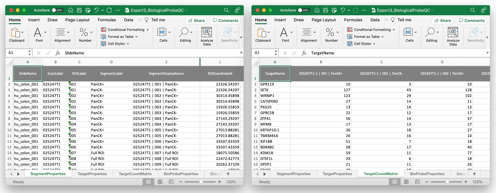

```{r setup, include=FALSE}
knitr::opts_chunk$set(echo = TRUE)
library(tidyverse)
```

## **GEVisor**: User-Friendly Exploration of Digital Spatial Profiling (DSP) Experiments

The _GEVisor_ web application allows users to directly input annotation Excel files
from the GeoMx Analysis Suite and perform exploratory analysis of gene expression
from each Region of Interest (ROI). _GEVisor_ is provided by the Moffitt Cancer Center.

This application was designed to help researchers to explore GeoMx-DSP data in an
user-friendly manner. Usually, GeoMx-DSP users are provided with an Excel file 
containing gene expression and annotations for each ROI (**Fig. 1**). Users can study this data 
set via the GeoMx Analysis Suite. Alternatively, to get a quick, user-friendly 
snapshot of the gene expression at each ROI, users can upload their Excel files to
_GEVisor_. With this app, users can obtain publication-quality plots showing
the gene expression at each ROI (**GE Visualization**), detect ROI clusters 
(**GE Clustering**), perform cell type deconvolution (**Deconvolution**), or
apply a novel method for the detection of groups of ROIs which accounts for the 
spatial autocorrelation  among them (**Spatial Analysis**).

```{r, echo=FALSE, out.width="95%", fig.cap="Excel file example"}

```

**Fig 1.** Example of Excel file from the GeoMx Analysis Suite, which is used as 
input to _GEVisor_.

To get started, please input below the Excel file (**Fig. 1**) and select the sample/slide
to analyze from your file. Optionally, provide the accompanying immunofluorescent 
image, which will be presented to ease comparison with the analyses plots.
